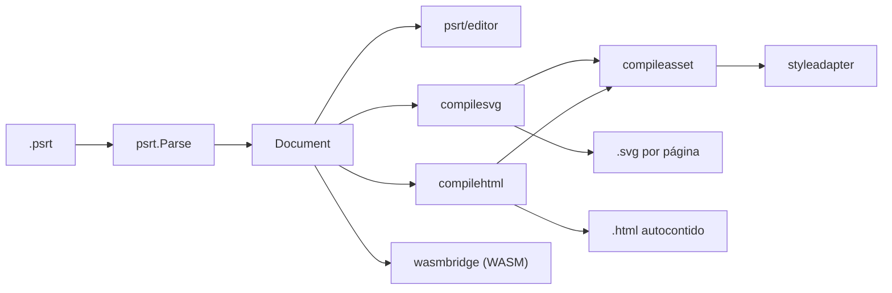

# psrt.core

[](go.mod)
[](LICENSE)

Implementação canônica em Go do **PSRT** — um formato de documento linear e textual para sobrepor textos (traduções, legendas, créditos) em páginas de imagem, como mangás, webtoons e capas de livros.

Este repositório é o **core** do ecossistema PSRT: a biblioteca de parse/serialização, os compiladores para SVG e HTML, as ferramentas de linha de comando, o editor desktop e a ponte WASM usada pelo SDK JavaScript.

## Índice

- [O que é o PSRT](#o-que-é-o-psrt)
- [O que tem neste repositório](#o-que-tem-neste-repositório)
- [Instalação](#instalação)
- [Uso rápido](#uso-rápido)
- [Usando a biblioteca em Go](#usando-a-biblioteca-em-go)
- [Arquitetura](#arquitetura)
- [Testes](#testes)
- [Ecossistema PSRT](#ecossistema-psrt)
- [Contribuindo](#contribuindo)
- [Licença](#licença)

## O que é o PSRT

Quem traduz ou revisa conteúdo visual — quadrinhos, webtoons, capas — geralmente precisa reposicionar texto sobre uma imagem já existente sem alterar a imagem em si. O PSRT resolve isso com um arquivo de texto simples (`.psrt`) que descreve, por página:

- a imagem de fundo;
- blocos de texto posicionados em percentual (`X-Y-Width-TextSize`);
- estilo de cada bloco em JSON inline (cor, fonte, sombra, borda, alinhamento);
- fontes e constantes reutilizáveis (`$FONTS`, `$CONSTS`, `@nome@`).

O nome vem da analogia com legendas `.srt`: assim como um `.srt` sincroniza texto com vídeo, o `.psrt` sincroniza texto com uma imagem — **"Picture SRT"**.

Por ser texto puro, um `.psrt` é **versionável em Git**, revisável em PR, e editável tanto à mão quanto por ferramentas. A partir dele, este repositório compila para dois formatos de **leitura universal**:

| Formato | Quem edita | Quem lê | Onde abre |
|---------|-----------|---------|-----------|
| **`.psrt`** | Autor/tradutor | Requer um leitor PSRT (ex.: `psrt-gui`) | Editor de texto ou leitor compatível |
| **SVG** | Gerado na compilação | Qualquer pessoa | Navegador, Inkscape, visualizador de imagem |
| **HTML** | Gerado na compilação | Qualquer pessoa | Qualquer navegador, offline, assets embutidos |

Exemplo mínimo de um `.psrt`:

```text
$START pagina1 | {"backGround":"#000000"} | https://example.com/page1.png
>>50-50-80-2 | {"color":"#FFFFFF","textAlign":"center"} | 0
Texto centralizado
$END pagina1
```

## O que tem neste repositório

| Caminho | Conteúdo |
|---------|----------|
| [`psrt/`](psrt/) | Pacote core: tipos (`Document`, `Page`, `Text`, `Mask`, `PathMask`), parse, serialização, JSON |
| [`psrt/editor`](psrt/editor/) | Mutações em memória sobre um `Document` já parseado |
| [`compileasset/`](compileasset/) | Resolução e cache de assets (imagens, fontes) referenciados por URL |
| [`styleadapter/`](styleadapter/) | Tradução do estilo JSON do PSRT para CSS/SVG |
| [`compilesvg/`](compilesvg/) | Compilador PSRT → SVG (um arquivo por página) |
| [`compilehtml/`](compilehtml/) | Compilador PSRT → HTML autocontido (com suporte a variantes) |
| [`svgpath/`](svgpath/) | Parsing e manipulação de paths SVG (usado pelas máscaras via path) |
| [`internal/visualapp`](internal/visualapp/) | Backend do editor desktop (Wails) |
| [`internal/wasmbridge`](internal/wasmbridge/) | Ponte `syscall/js` exposta ao SDK JavaScript via WASM |
| [`internal/webconnector`](internal/webconnector/) | Servidor HTTP local que conecta um editor web ao filesystem do usuário |
| [`cmd/`](cmd/) | Binários (ver tabela abaixo) |

### Comandos (`cmd/`)

| Binário | Descrição |
|---------|-----------|
| `cli` (`psrt`) | Converte e fatia documentos: PSRT ↔ JSON, export Markdown, slicing por página/bloco/constante |
| `psrt-edit` | Edita um `.psrt` via linha de comando (conteúdo, posição, estilo, páginas, constantes) — útil em CI/scripts |
| `compile` | Compila PSRT → HTML autocontido |
| `compile-svg` | Compila PSRT → uma pasta de SVGs (um por página) |
| `psrt-gui` | Editor desktop (Wails + React): canvas WEB editável, abas de preview SVG/HTML/PSRT |
| `psrt-gui-dev` | Backend HTTP do editor visual para desenvolvimento do frontend web |
| `psrt-web-connector` | Servidor local com sandbox e pareamento que dá a um editor web acesso ao filesystem |
| `psrt-wasm` | Build alvo `GOOS=js GOARCH=wasm` que expõe o core ao [SDK JavaScript](#ecossistema-psrt) |

## Instalação

Requer **Go 1.22+**.

```bash
git clone https://github.com/Dcrispim/psrt.core.git
cd psrt.core
go build ./...
```

Para um binário específico, por exemplo o conversor `psrt`:

```bash
go build -o psrt.exe ./cmd/cli
```

## Uso rápido

```bash
# PSRT -> JSON
go run ./cmd/cli --input=exemplo.psrt --output=exemplo.json

# PSRT -> HTML autocontido (offline, assets embutidos)
go run ./cmd/compile --input=exemplo.psrt --output=exemplo.html

# PSRT -> SVG (um arquivo por página)
go run ./cmd/compile-svg --input=exemplo.psrt --output-dir=./out-svg

# Editar um bloco de texto pela CLI
go run ./cmd/psrt-edit --input=exemplo.psrt --page=pagina1 --text=0 --content="Novo texto"
```

## Usando a biblioteca em Go

```go
package main

import (
	"fmt"
	"os"

	"github.com/Dcrispim/psrt.core/psrt"
)

func main() {
	f, err := os.Open("exemplo.psrt")
	if err != nil {
		panic(err)
	}
	defer f.Close()

	doc, err := psrt.Parse(f)
	if err != nil {
		panic(err)
	}

	// Document -> JSON
	out, err := psrt.ToJSON(doc)
	if err != nil {
		panic(err)
	}
	fmt.Println(string(out))

	// Document -> PSRT (round-trip)
	restored, err := psrt.FormatPSRT(doc, false)
	if err != nil {
		panic(err)
	}
	fmt.Println(string(restored))
}
```

```bash
go get github.com/Dcrispim/psrt.core/psrt
```

## Arquitetura



1. **Parse** — `psrt.Parse` lê o `.psrt` e produz um `Document` em memória.
2. **Edição** — `psrt/editor` ou o backend do `psrt-gui` mutam o `Document`.
3. **Serialização** — `psrt.FormatPSRT` (volta para texto) ou `psrt.ToJSON`.
4. **Compilação** — `compilesvg`/`compilehtml` resolvem constantes, buscam assets via `compileasset`, adaptam estilos via `styleadapter` e geram a saída final.

## Testes

```bash
go test ./...
```

## Ecossistema PSRT

Este repositório é a peça central, mas o PSRT também tem:

- **SDK JavaScript** (`@psrt/sdk`) — TypeScript + WASM compilado a partir de `cmd/psrt-wasm`/`internal/wasmbridge`, para ler e renderizar PSRT no browser.
- **Editor web** — frontend que usa o SDK e, opcionalmente, o `psrt-web-connector` para acessar arquivos locais.

## Contribuindo

Contribuições são bem-vindas — issues, relatos de bugs e pull requests.

1. Abra uma issue descrevendo o problema ou a proposta antes de PRs grandes.
2. Mantenha mudanças focadas; adicione testes (`go test ./...`) para parsing, formatação e compiladores.
3. Siga o estilo já presente no código (`gofmt`/`go vet` antes de enviar).

## Licença

Distribuído sob a licença [MIT](LICENSE).
